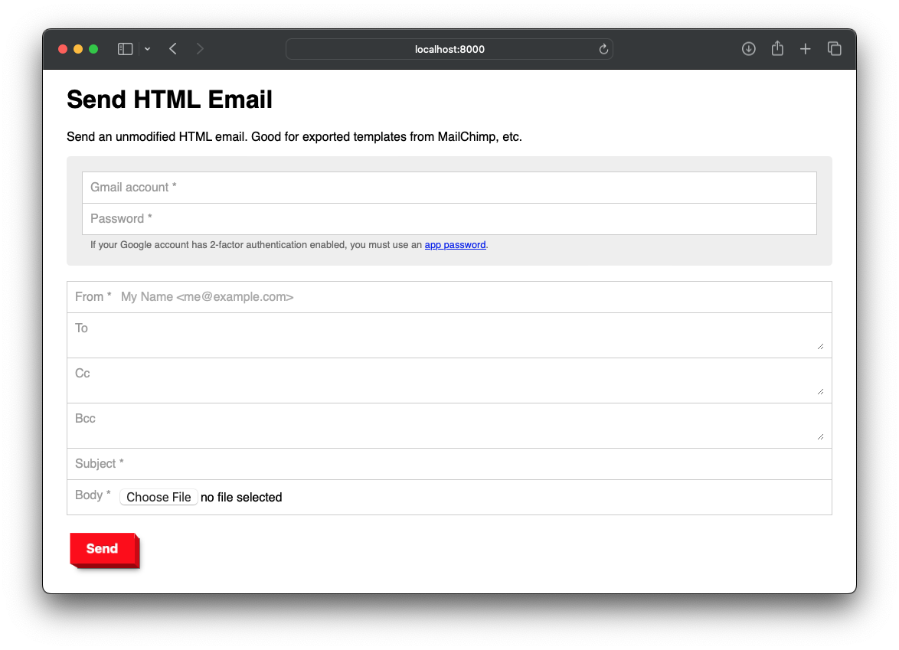

# Send HTML Email

This app lets you send unmodified HTML with your Gmail account. This can preserve the layout of a message in a way that most email clients don't. It has been tested with templates generated by MailChimp.

## How it works

It sends mail through GMail's SMTP servers using the account you provide. If you have 2-Step Verification set up, you will need an [app password](https://myaccount.google.com/apppasswords) for your Google account for this to work. If you use Google Workspace, you may need to [enable app passwords](https://knowledge.workspace.google.com/kb/how-to-enable-less-secure-application-access-000006971).

> [!IMPORTANT]  
> An app password allows full read and write access to your Gmail. You should only give it to people or apps that you trust. Please audit this code before use.

## Install

Run `docker compose up`, then use it at `http://localhost:8000`. Or, put the contents of the `src` folder on any host that supports PHP.

Optionally, edit the `defaults.ini` file to set default values for the form fields.

## Acknowledgments

This app uses [PHPMailer](https://github.com/PHPMailer/PHPMailer) to send mail, and a copy of it is included in the `src` folder.
